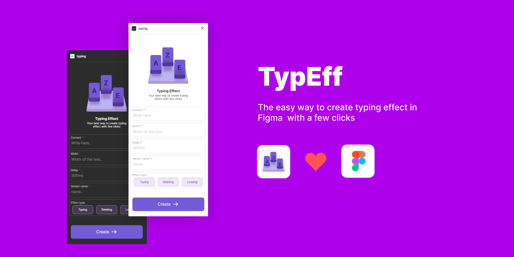

# Typeff

The Figma plugin you described is a typing effect plugin that enables users to create dynamic text animations within their Figma designs. It provides three options: typing, deleting, and looping.

With the typing option, users can simulate the effect of text being typed out character by character, creating an animated typing effect. The plugin allows users to customize the typing speed, font, and other properties to achieve the desired effect.

The deleting option allows users to simulate the effect of text being erased character by character, mimicking the backspace or delete action. This can be useful for creating dynamic and interactive text animations within Figma designs.

The looping option allows users to continuously repeat the typing and deleting animation, creating an ongoing loop effect. This can be particularly handy for creating eye-catching and attention-grabbing text-based animations or prototypes.

Overall, this Figma plugin offers a convenient way to add dynamic typing effects to text elements in Figma, enhancing the visual appeal and interactivity of designs.
